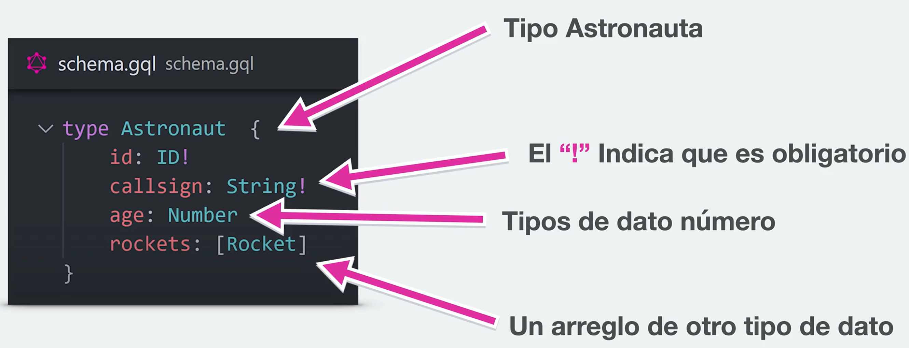

# Apuntes de NestJS + GraphQL

## Repaso

- **Controller**: donde se escuchan las peticiones
- **Service**: maneja la lógica de negocio
- **Module**: agrupador
- **Entity**: es una representación de como luce una entrada en la base de datos
- **DTO (Data Transfer Object)**: es utilizado para asegurarse que la información del `body` sea la esperada

## GraphQL

Es un lenguaje para leer y mutar data mediante APIs (Query language). Permite devolver al frontend solo la información que necesita o es requerida y así reducir el uso de ancho de banda.

- **Schema First (Schema Definition Language - SDL)**: quiere decir que comenzamos a trabajar y crear los tipos/esquemas de la manera tradicional.
- **Code First**: las clases y definiciones se crear desde Typescript, el cual crea automáticamente el SDL por nosotros.

- **Resolvers**: contienen las instrucciones para transformar las peticiones del cliente en datos que GraphQL pueda utilizar. Son similares a un Controller pero técnicamente son `providers`.
- **Arguments**: información adicional que se puede enviar en las queries.
- **Fragment**: forma para reutilizar un conjunto de campos para luego utilizarlos en mútiples consultas o mutaciones.
- **Mutations**: queries que se utilizan para modificar la información guardada y devolver un valor.
- **Inputs**: lo que comúnmente se llama _"body"_ en un petición REST tradicional.
- **Enums**: permite definir un conjunto de posibles valores para un campo.

Para saber cuando utilizar un _ObjectType_ o un _InputType_, básicamente depende de la petición, si es una mutación donde se espera información desde el frontend eso sería un _Input_, en cambio, los _Object_ están más relacionado con una respuesta de retorno personalizada.

**_Créditos_**

👉 [https://cursos.devtalles.com/courses/nest-graphql](https://cursos.devtalles.com/courses/nest-graphql)
